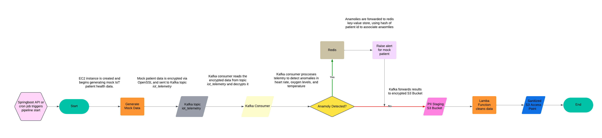

# **IoT HealthSync**
## Overview

 Welcome to **IoT HealthSync**! This project implements a secure and scalable data pipeline for processing mock IoT telemetry data in a healthcare enviornment. It focuses on encryption, anomaly detection for patients, and compliance with standards like **HIPAA**. 
 **Kafka** serves as the real-time message broker for telemetry ingestion, while **Redis** is used for fast, real-time anomaly logging and alerting. A **Lambda function** automates data cleaning and compliance enforcement by removing PII from encrypted data before long-term storage in **S3**.

### Compliance and Security
This pipeline is designed to adhere to **HIPAA (Health Insurance Portability and Accountability Act)** requirements, ensuring the secure handling and storage of sensitive health data through:
- **End-to-end encryption** of data at rest and in-transit.
- **PII stripping** using AWS Lambda for compliance before long-term storage.
- **Access control**
    - **IAM (Identity and Access Management)** policies and roles enforce secure and granular access to AWS resources.
    - **VPC (Virtual Private Cloud)** ensures secure network isolation for Kafka brokers, Redis, and other resources.
    - **S3 Bucket Policies** allow for more granular restricton to S3 buckets.

## Core Technology Stack

---

## Pipeline Architecture

  

---

## Table of Contents
1. [Key Features](#key-features)
    - [Real-Time Data Pipeline](#real-time-data-pipeline)
    - [Interoperability](#interoperability)
    - [Linux-Based Simulation and Monitoring](#linux-based-simulation-and-monitoring)
    - [Fast Data Access and Archiving](#fast-data-access-and-archiving)
2. [Architecture Overview](#architecture-overview)
    - [IoT Devices and Data Ingestion](#iot-devices-and-data-ingestion)
    - [Data Pipeline and Processing](#data-pipeline-and-processing)
    - [Data Pipeline](#data-pipeline)
    - [Data Storage](#data-storage)
    - [Compute Orchestration](#compute-orchestration)
    - [Security](#security)
3. [Detailed Tech Stack](#detailed-tech-stack)

## Key Features

### Real-Time Data Pipeline
- Collects, processes, and analyzes telemetry data from simulated IoT devices in real-time using Kafka Streams.
- Detects anomalies in patient vitals (e.g., oxygen levels dropping below safe thresholds).

### Interoperability
- Formats telemetry data into HIPAA/FHIR-compliant JSON for integration with healthcare systems like EHRs (Electronic Health Records).

### Linux-Based Simulation and Monitoring
- Utilizes Linux Bash scripts and netcat for IoT device simulation, sending telemetry via TCP sockets.
- Monitors Kafka, Redis, and network traffic with Linux tools such as `tcpdump`, `htop`, and `netstat`.

### Fast Data Access and Archiving
- Leverages Redis for caching recent vitals and Amazon S3 for archiving historical data.
- Employs AWS S3 Lambda Access Points to strip PII from data before long-term storage.

---

## Architecture Overview

This project implements a secure and scalable pipeline for processing IoT telemetry data with an emphasis on encryption, anomaly detection, and compliance.

### IoT Devices and Data Ingestion
- Simulated IoT devices (via Linux scripts) generate telemetry data (e.g., heart rate, oxygen saturation) and send it over TCP sockets.
- A Python-based socket server validates the data and forwards it to Kafka topics for real-time processing.

### Data Pipeline and Processing
- **Kafka Streams** processes incoming data for:
  - Detecting anomalies in telemetry.
  - Formatting data into FHIR/HIPAA-compliant JSON.
- Anomalies are flagged and cached in **Redis** for real-time alerts and dashboards.

### Data Storage
- **Redis**: Caches live patient vitals and anomaly alerts for quick retrieval.
- **Amazon S3**:
  - **Raw Data Bucket**: Temporarily stores raw encrypted telemetry data.
  - **Processed Data Bucket**: Stores cleaned, PII-free data for long-term archival and analytics. Both buckets use AES-256 encryption for data at rest.

### Event-Triggered Lambda Functions
- AWS Lambda functions are triggered by S3 uploads:
  - **Raw Data Processing**: Decrypts, cleans, and removes PII from incoming data.
  - **Processed Data Storage**: Sanitized data is forwarded to the processed S3 bucket.

### Compute and Orchestration
- **EC2 Instances**: Handle compute-intensive tasks such as generating patient trends and real-time alerts.
- **AWS Lambda**: Automates compliance checks and PII removal during S3 data processing.

### Security
- **Data in Transit**: All communications are encrypted using SSL/TLS with AES-256.
- **Data at Rest**: Both Redis and S3 use AES-256 encryption to secure stored sensitive data.
- **Firewalls**: Tools like `iptables` restrict access to Kafka and Redis, ensuring secure network boundaries.

### Monitoring and Debugging
- **Linux tools** (`tcpdump`, `htop`, `netstat`) and **AWS CloudWatch** are used to monitor system performance, debug networking, and optimize data flow.

---

## Detailed Tech Stack

### IoT Simulation
- Linux Bash scripts, `netcat`, and cron jobs for periodic data generation.

### Data Pipeline
- Apache Kafka and Kafka Streams for ingestion and processing.

### Networking
- TCP sockets, `iptables` for firewalls, VPC for network isolation, and HAProxy for load balancing.

### Storage
- Redis for low-latency access to anomalies and Amazon S3 for long-term archiving.
- The S3 Lambda Access Point ensures that data stripped of PII is archived in compliance with privacy regulations.

### Compute Orchestration
- AWS Lambda functions to trigger job execution on EC2 instances for scalability and efficiency.

### Security and Encryption
- AES-256 encryption for data at rest and in transit.
- SSL/TLS protocols for secure communication.
- IAM roles for secure access control to AWS resources.
